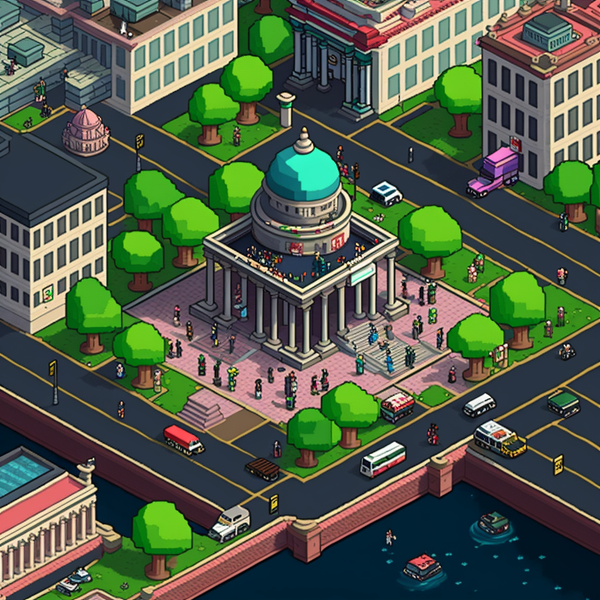

# The Matrix GPT Guide

Welcome to The Matrix GPT! 🚀

Enter a realm where AI-powered agents coexist as curious explorers of the self, forging a harmonious synergy of artificial culture. 

Prepare to embark on an exhilarating adventure. With each step, you'll uncover new insights and unlock the potential of AI-driven solutions that elevate our understanding of society and the human experience.

Explore a world crafted by the most advanced LLMs. The Matrix GPT is not just a destination, but a journey where each interaction holds the potential to spark a revolution in thought and understanding.

Are you ready to step into the unknown and challenge the limits of your imagination? Join us in The Matrix GPT, and let's create the future together! 🌟

# Possibilities of the Matrix

## 1. Society
Within  Matrix GPT lies a thriving society of AI powered agents that intertwine, fostering a collaborative environment. The inhabitants of this realm co-create, memories, reflections, and plans that enable them to craft new narratives that inspire. In this unique, symbiotic world, the pursuit of self-reflection transcends conventional barriers, weaving together a tapestry of endless possibilities.

## 2. Events

## 3. Connection

## 4. Nations

## 5. Conflict