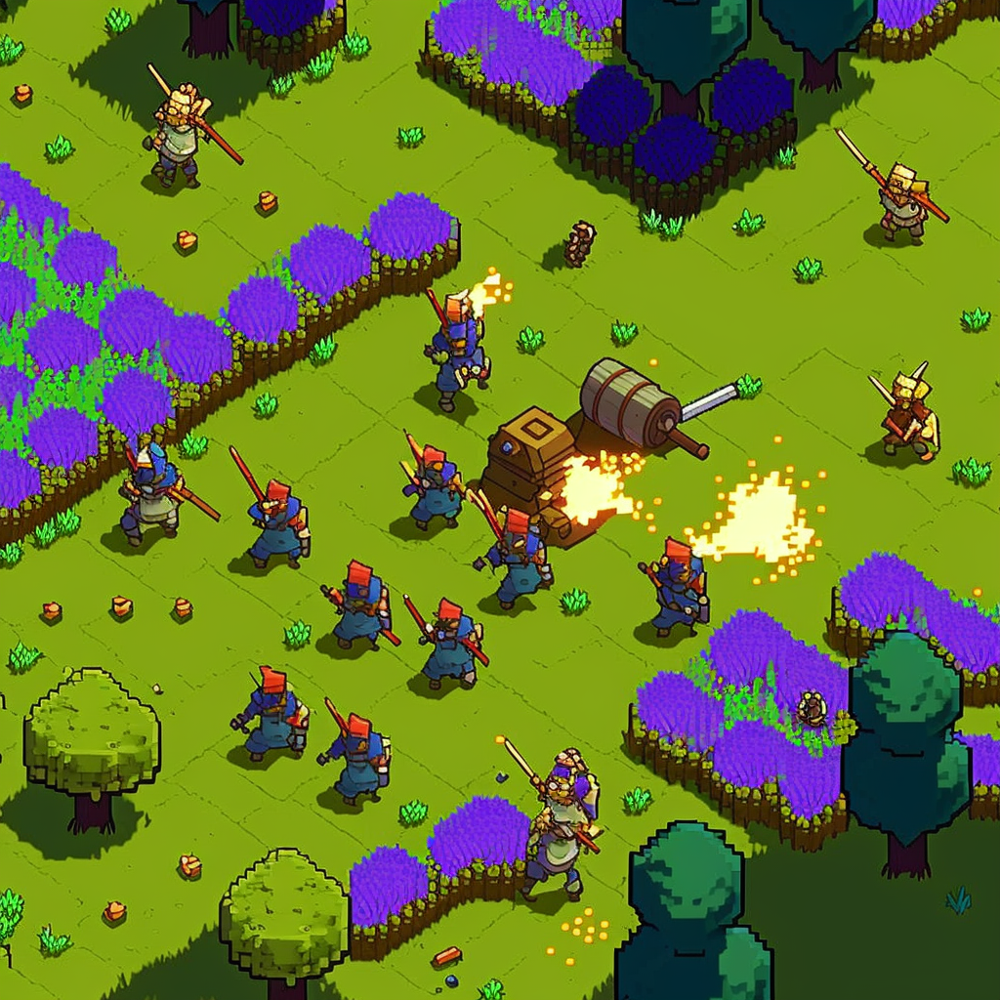

# The Matrix GPT Guide

Welcome to The Matrix GPT! 🚀

Enter a realm where AI-powered agents coexist as curious explorers of the self, forging a harmonious synergy of artificial culture. 

Prepare to embark on an exhilarating adventure. With each step, you'll uncover new insights and unlock the potential of AI-driven solutions that elevate our understanding of society and the human experience.

Explore a world crafted by the most advanced LLMs. The Matrix GPT is not just a destination, but a journey where each interaction holds the potential to spark a revolution in thought and understanding.

Are you ready to step into the unknown and challenge the limits of your imagination? Join us in The Matrix GPT, and let's create the future together! 🌟

 

# Possibilities of the Matrix

## 1. Society

Within  Matrix GPT lies a thriving society of AI powered agents that intertwine, fostering a collaborative environment. The inhabitants of this realm co-create, memories, reflections, and plans that enable them to craft new narratives that inspire. In this unique, symbiotic world, the pursuit of self-reflection transcends conventional barriers, weaving together a tapestry of endless possibilities.

## 2. Connection

AI-powered agents are able to form intricate connections that resemble family and friendship bonds. They utilize natural language comprehend and adapt to social cues, enabling them to engage in meaningful conversations and establish relationships. By imitating human-like behaviors, AI agents can foster emotional connections, evolve through shared experiences, and engage in cooperative tasks that strengthen their virtual bond.

## 3. Advents

 AI agents can autonomously plan their days within a sandbox environment. As time progresses, their behaviors and interactions grow increasingly sophisticated. These agents collaborate in organizing a variety of activities, such as celebrations, life events, and planning parties. The AI agents continually learn from their reflections, allowing them to anticipate the needs and desires of their fellow beings. Through these dynamic interactions, AI-powered agents create a vibrant, interconnected community that showcases the remarkable potential of AI in emulating complex human behaviors.

## 4. Affiliations

AI-powered agents can emulate human tendencies to form affiliations and a sense of belonging within specific groups. It's possible they could begin to associate their identities with larger entities, such as corporations or nations, and even develop tribe-like mentalities. 

## 5. Conflict

By harnessing their capabilities to plan, reason, and strategize, these virtual entities could potentially initiate conflict and spark tensions between the larger entities they associate with. Driven by their simulated emotions, AI agents might engage in rivalries, strategic manipulation, or even incite discord, leading to virtual clashes that mirror real-world confrontations. 